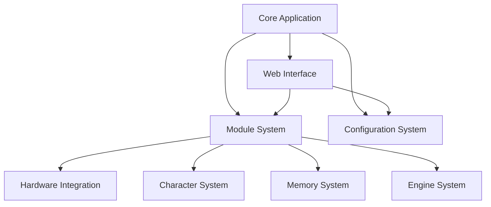

# TARS-AI System Architecture Overview

## High-Level Architecture
TARS-AI is a modular system with the following main components:

1. **Core Application**
   - Main entry point (app.py)
   - Server components (app-server.py)
   - Hardware testing (app-servotester.py)

2. **Module System**
   - Speech processing (STT, TTS)
   - Memory management
   - Character personality
   - Hardware control
   - AI capabilities

3. **Configuration System**
   - Centralized configuration management
   - Environment variable support
   - Modular configuration sections

4. **Hardware Integration**
   - Servo motor control
   - Input device handling
   - Sensor integration

5. **Character System**
   - Personality traits
   - Voice profiles
   - Response patterns

6. **Memory System**
   - Short-term memory
   - Long-term memory
   - Contextual retrieval

7. **Engine System**
   - Model training
   - Real-time inference
   - Performance optimization

8. **Web Interface**
   - REST API
   - WebSocket support
   - Configuration UI

## Component Interaction

## Data Flow
1. User input (voice/text) → STT Module → Memory System
2. Memory System → LLM Engine → Character System
3. Character System → TTS Module → Audio Output
4. Hardware Input → Control Module → Movement System
5. Web Interface ↔ Configuration System ↔ All Modules